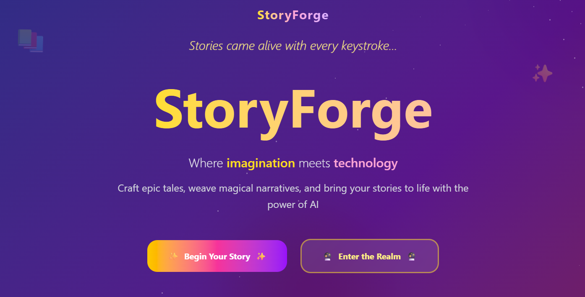
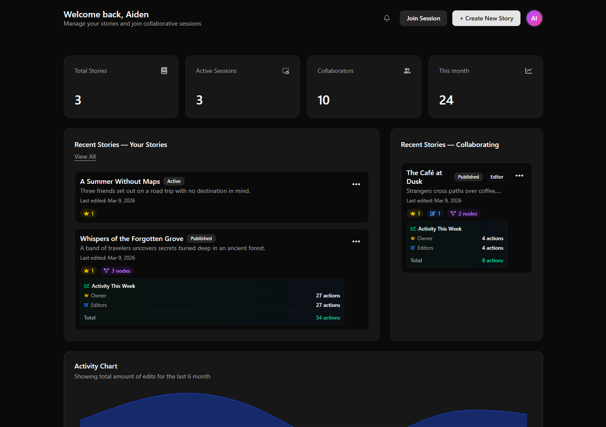
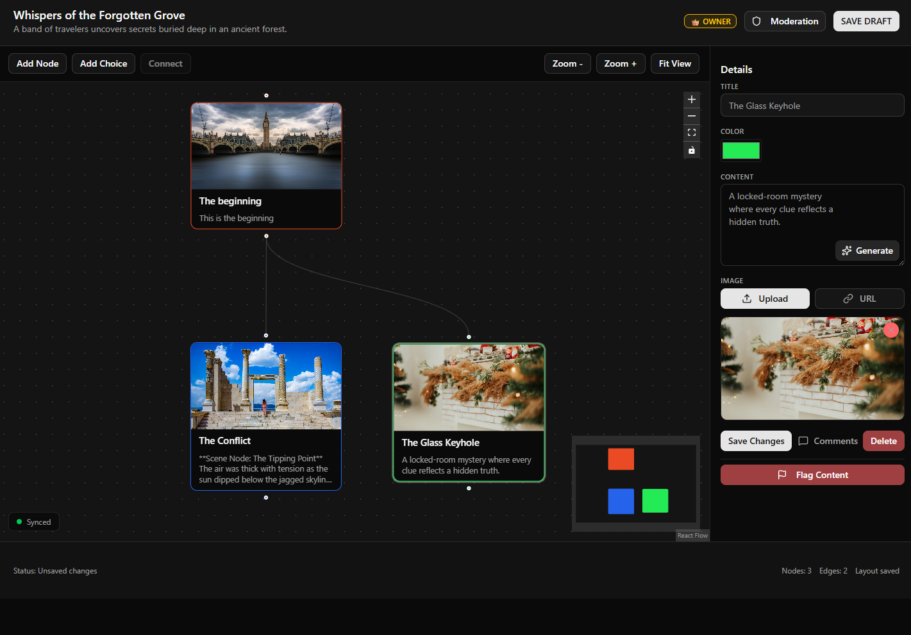

# StoryForge

StoryForge is a collaborative story board that allows users to create story in a node based editor. Checkout the latest version: https://storyforge-deploy-7f9bd2d.vercel.app/



## Dashboard


## Story Editor


## Getting Started

Build the project

```bash
# Clone the project
git clone https://github.com/StoryForge-PRJ566-Team7/StoryForge-Development.git
cd StoryForge-Development

# Install the dependencies
npm install

# Add environment variables, follow .env.example, add your own .env.local
# Run the project
npm run dev
```

Open [http://localhost:3000](http://localhost:3000) with your browser to see the result.

## Architecture

### Tech Stack

**Frontend:**
- **Next.js 15.5.7** - React framework with App Router for server-side rendering and API routes
- **React 19.1.2** - UI library with modern concurrent features
- **React Flow** (@xyflow/react) - Node-based graph editor for story visualization
- **Zustand** - Lightweight state management for client-side graph state
- **Tailwind CSS** - Utility-first CSS framework for styling
- **shadcn/ui** - Reusable component library

**Backend:**
- **Next.js API Routes** - Serverless API endpoints
- **MongoDB Atlas** - Cloud-hosted NoSQL database
- **GridFS** - MongoDB file storage for node images
- **JWT** - Token-based authentication
- **bcrypt** - Password hashing

**AI Integration:**
- **OpenAI API** - GPT-powered content generation for story nodes

**Email:**
- **Nodemailer** - SMTP email service for password recovery

### System Architecture

**Client Layer:**
- **Dashboard** - User room management and activity overview (React)
- **Story Editor** - Node-based graph editor with drag-and-drop (React Flow)
- **Auth** - Login, registration, and password recovery forms
- **Zustand Store** - Centralized state management for graph data and real-time sync

**API Layer (Next.js Serverless):**
- `/api/auth` - Authentication endpoints (login, register, password reset)
- `/api/rooms` - Room CRUD operations and settings
- `/api/rooms/[roomId]/nodes` - Story node management with image uploads
- `/api/rooms/[roomId]/edges` - Story connection/edge management
- `/api/rooms/[roomId]/members` - Collaborator and role management
- `/api/generate-content` - OpenAI-powered content generation
- **MongoDB Connection Pool** - Serverless-optimized with connection reuse

**Database Layer (MongoDB Atlas):**
- **users** - User accounts and authentication data
- **rooms** - Story project metadata and settings
- **nodes** - Individual story nodes with content
- **edges** - Connections between story nodes
- **roomMembers** - User-room relationships and roles
- **deletions** - Temporary deletion tracking (7-day TTL)
- **activityLogs** - Audit trail for room actions
- **GridFS** - Binary storage for node images

### Key Features

**Collaborative Editing:**
- Real-time synchronization using incremental polling (2-second intervals)
- Optimistic UI updates with conflict resolution
- Explicit deletion tracking via `deletions` collection with TTL (7-day auto-cleanup)
- Smart sync that excludes dragging nodes to prevent conflicts

**Authentication & Authorization:**
- JWT-based session management with HTTP-only cookies
- Role-based access control (Owner, Editor, Viewer)
- Password recovery via email verification codes
- Secure password hashing with bcrypt

**Story Graph:**
- Node-based story editor with drag-and-drop interface
- Branch creation and forking for alternate storylines
- Image uploads stored in GridFS
- Comment threads on individual nodes
- Activity logging for audit trails

**Database Design:**
- **Serverless-optimized connections** - Connection pooling with 10s timeout
- **Incremental sync** - Fetch only changes in the story room since last poll (`?since` parameter)
- **GridFS** - Efficient image storage with streaming support


### Deployment

- **Platform:** Vercel (serverless)
- **Database:** MongoDB Atlas (shared cluster)
- **Environment Variables:** See `.env.example` for required configuration
- **deployment:** Deployed to personal Vercel account since organization owned projects requires Vercel teams


### Deviations From PRJ566

**1. Collaborative Sync Architecture: CRDT → Incremental Polling**

Original Plan (PRJ566): Implement Conflict-Free Replicated Data Types (CRDT) using Yjs for real-time collaborative editing with WebSocket connections.

Current Implementation: HTTP-based incremental polling with explicit deletion tracking.

Rationale:
- **Serverless Compatibility** - WebSockets require persistent connections, which are challenging and costly on Vercel's serverless platform. Polling works seamlessly with stateless functions.
- **Simplified Architecture** - CRDT libraries like Yjs add significant complexity and bundle size. Our polling approach with `?since` timestamps is easier to debug and maintain.
- **Cost Efficiency** - WebSocket connections on Vercel require costly upgrades. Polling with 2-second intervals provides adequate real-time feel for our use case without additional infrastructure costs.
- **Trade-offs** - While CRDT offers true eventual consistency, our polling approach with optimistic updates and conflict resolution (last-write-wins) is sufficient for story editing where simultaneous edits to the same node are rare.

**2. AI Content Generation: Separate Page → Integrated Menu**

*Original Plan (PRJ566):* Dedicated AI generation page where users configure prompts and generate content, then manually add it to story nodes.

*Current Implementation:* AI generation integrated directly into the node editor's context menu.

*Rationale:*
- **Improved UX** - Users can generate content directly within their workflow without context switching.
- **Space Efficiency** - No need for additional navigation items or pages, keeping the UI clean and focused on the story graph.

**3. Branch Merging: Not Implemented**

*Original Plan (PRJ566):* Allow users to merge forked branches back into the main storyline with conflict resolution UI.

*Current Implementation:* Forking creates independent copies. No merge functionality.

*Rationale:*
- **Complexity Reduction** - Branch merging requires sophisticated conflict resolution UI, diff algorithms, and edge case handling (circular references, deleted nodes, etc.). This adds significant development time with limited ROI for MVP.
- **Use Case Analysis** - Story forking is primarily used for exploring "what-if" scenarios or creating alternative endings. In practice, users rarely need to merge these back—they either keep them separate or manually copy desired content.
- **Future Consideration** - Can be implemented post-launch if there's a strong demand.